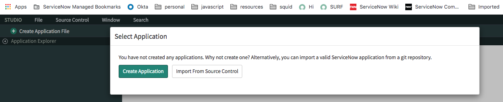
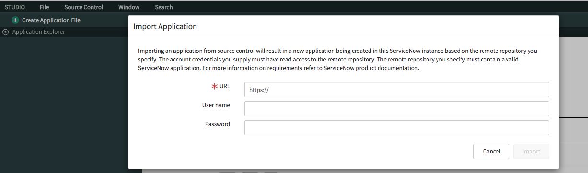
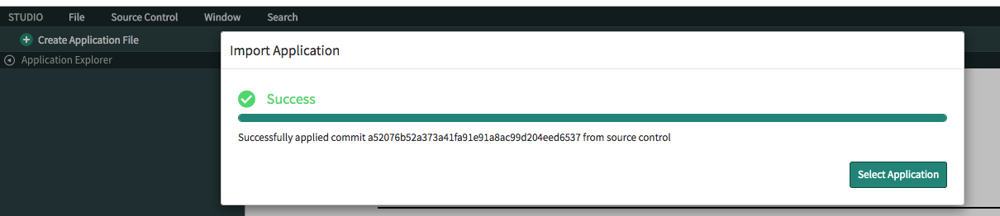
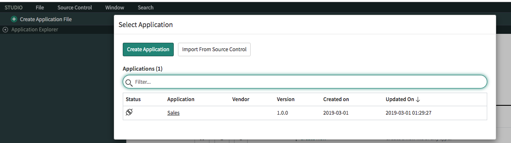
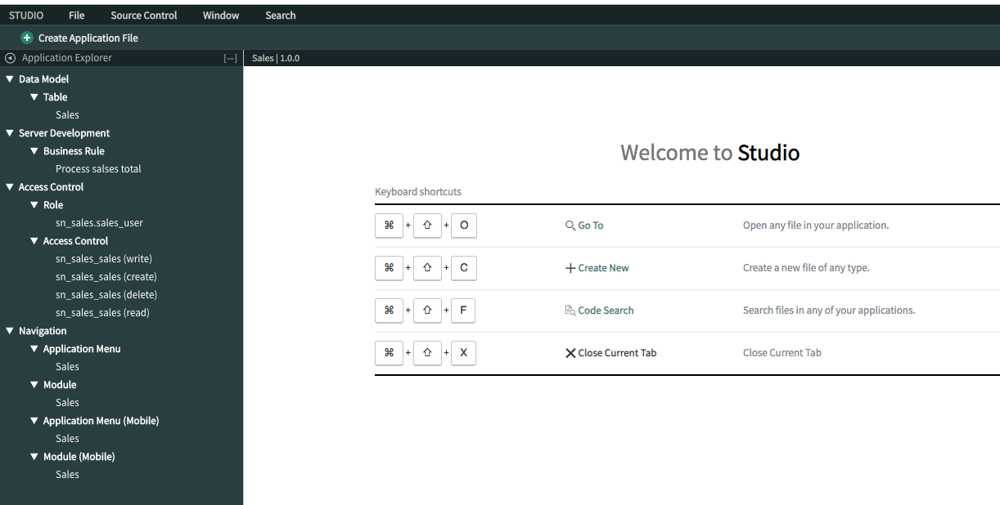

# Section 0 : Lab Setup
## Section Goal

Before we get started building concurrent imports, we need to get our lab instance set up.

In this lab first you will create a Data Source, Transform Map and a Scheduled Import. Then run the Scheduled Import with and without concurrent import. 

## Clone the git repository to your machine

1. Run the following command

    `git clone https://github.com/amilaSuriarachchi/knowledge.git knowledge`

2. This downloads the lab content to your machine

## Import the lab set up to your machine

1. Goto **System Application -> Studio**

    

2. Click on **Import From Source Control**
 
    

3. Set the URL as `https://github.com/amilaSuriarachchi/knowledge.git`

4. Click **Import**

    

5. Click **Select Application**

    

6. Click **Sales**

    

