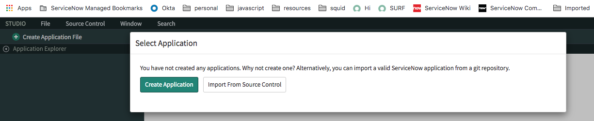
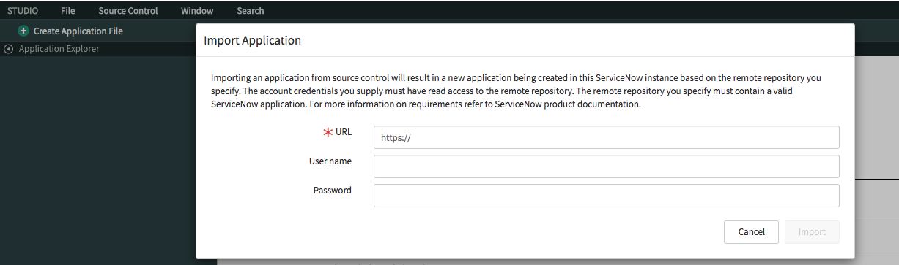
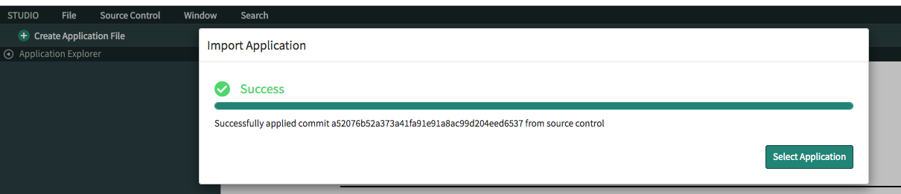
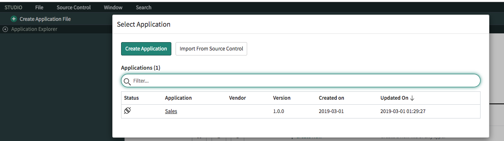
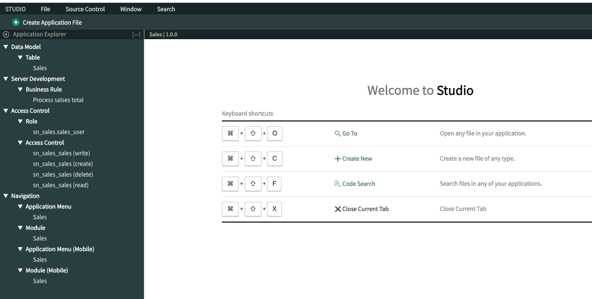
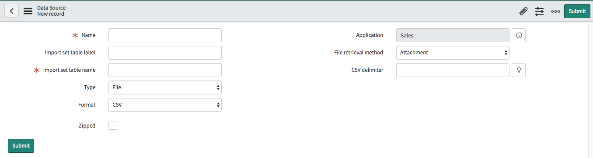
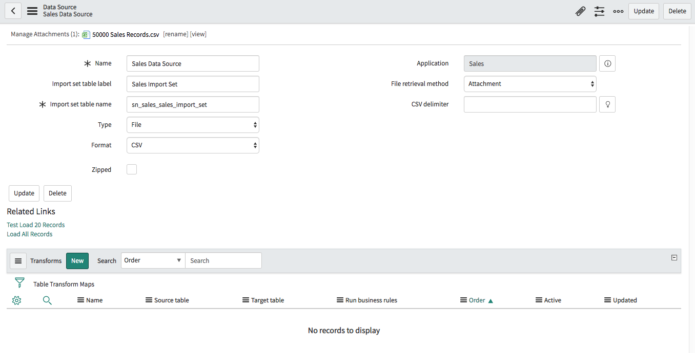
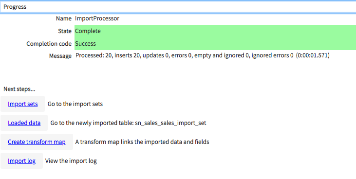
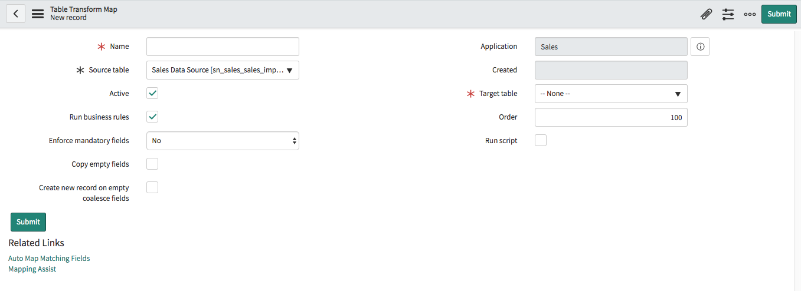

# Section 0 : Lab Setup
## Section Goal

Before we get started building concurrent imports, we need to get our lab instance set up.

In this lab first you will create a Data Source, Transform Map and a Scheduled Import. Then run the Scheduled Import with and without concurrent import. 

## Clone the git repository to your machine

1. Run the following command

    `git clone https://github.com/amilaSuriarachchi/knowledge.git knowledge`

2. This downloads the lab content to your machine

## Import the lab set up to your machine

1. Goto **System Application -> Studio**

    

2. Click on **Import From Source Control**
 
    

3. Set the URL as `https://github.com/amilaSuriarachchi/knowledge.git`

4. Click **Import**

    

5. Click **Select Application**

    

6. Click **Sales**

    

# Section 1 : Set up **Data Source** and **Transform Map**

## Section Goal

**Data Sources** are used to specify from where to import data to ServiceNow. **Transform Maps** are used to define the mapping between the imported data and ServiceNow instance tables. In this section you will learn how to create a **Data Source** to import sales data and create a **Transform Map** to map the imported data to Sales table. Sales table is a predefined table for the application and loaded when importing application from the source control.

## Creating **Sales Data Source**

1. Go to **System Import Sets -> Administration -> Data Sources**

2. Click **New**

    

3. Enter **Name** : Sales Data Source

4. Enter **Import set table label** : Sales Import Set

5. Click on **Manage Attachments** and choose `50000 Sales Records.csv` from the application cloned location.

6. Right click on top panel and click **Save**

    

## Creating **Transform Map**

1. Click on **Test Load 20 Records**. This loads the first 20 records from the '50000 Sales Records.csv` to staging table *Sales Data Source[sn_sales_sales_import_set]*.

    

2. Click on **Create Transform Map**

    

3. Enter **Name** : Sales Transform Map**

4. Set **Target table** : Sales[sn_sales_sales]

5. Clieck on **Auto Map Matching Fields**. This maps the staging table **Sales Data Source[sn_sales_sales_import_set]** fields to target table *Sales[sn_sales_sales]* fields.

## Creating a **Coalesce** field

1. On the *u_order_id* row set Coalesce to *true*

2. Click on  **Index Coalesce Fields**. Always it is important to index coalesce fileds to avoid performance issues.

3. Select **Do not notify me** and click **OK**

## Setting the date format to date fields

1. Click on *u_ship_date* row.

2. Set the **Date format** : *MM/dd/yyyy*. This is the date format used in csv file to specify dates. System uses this format to interpret the date and store it as a date filed in ServiceNow table.

3. Click on **Update**

4. Do the same to *u_order_date*

