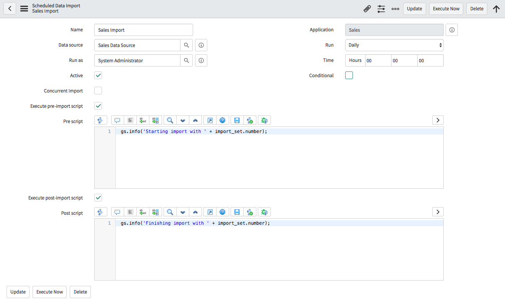
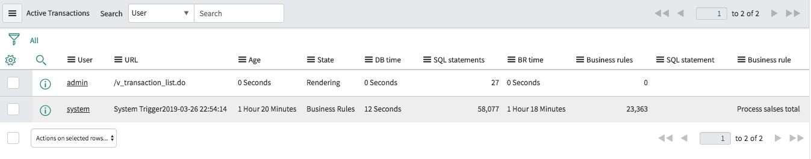

# Section 0 : Lab Setup
## Section Goal

Before we get started building concurrent imports, we need to get our lab instance set up.

In this lab first you will create a Data Source, Transform Map and a Scheduled Import. Then run the Scheduled Import with and without concurrent import. 

## Clone the git repository to your machine

1. Run the following command

    `git clone https://github.com/amilaSuriarachchi/knowledge.git knowledge`

2. This downloads the lab content to your machine

## Import the lab set up to your machine

1. Goto **System Application -> Studio**

    

2. Click on **Import From Source Control**
 
    

3. Set the URL as `https://github.com/amilaSuriarachchi/knowledge.git`

4. Click **Import**

    

5. Click **Select Application**

    

6. Click **Sales**

    

# Section 1 : Set up **Data Source** and **Transform Map**

## Section Goal

**Data Sources** are used to specify from where to import data to ServiceNow. **Transform Maps** are used to define the mapping between the imported data and ServiceNow instance tables. In this section you will learn how to create a **Data Source** to import sales data and create a **Transform Map** to map the imported data to Sales table. Sales table is a predefined table for the application and loaded when importing application from the source control.

## Creating **Sales Data Source**

1. Go to **System Import Sets** -> **Administration** -> **Data Sources**

2. Click **New**

    

3. Enter **Name** : Sales Data Source

4. Enter **Import set table label** : Sales Import Set

5. Click on **Manage Attachments** and choose `50000 Sales Records.csv` from the application cloned location.

6. Right click on top panel and click **Save**

    

## Creating **Transform Map**

1. Click on **Test Load 20 Records**. This loads the first 20 records from the '50000 Sales Records.csv` to staging table *Sales Data Source[sn_sales_sales_import_set]*.

    

2. Click on **Create Transform Map**

    

3. Enter **Name** : Sales Transform Map

4. Set **Target table** : Sales[sn_sales_sales]

5. Clieck on **Auto Map Matching Fields**. This maps the staging table *Sales Data Source[sn_sales_sales_import_set]* fields to target table *Sales[sn_sales_sales]* fields.

## Creating a **Coalesce** field

1. On the *u_order_id* row set Coalesce to *true*

2. Click on  **Index Coalesce Fields**. Always it is important to index coalesce fileds to avoid performance issues.

3. Select **Do not notify me** and click **OK**

## Setting the date format to date fields

1. Click on *u_ship_date* row.

2. Set the **Date format** : *MM/dd/yyyy*. This is the date format used in csv file to specify dates. System uses this format to interpret the date and store it as a date filed in ServiceNow table.

3. Click on **Update**

4. Do the same to *u_order_date*

# Section 2 : Create a **Scheduled Import** and Import Data

## Section Goal

**Scheduled Imports** are used to periodically fetch data into ServiceNow instances. When importing data first it creates an import set and imports data into it. We can monitor the progress of the import through the import set. In this section we creates a schedlued import and execute it. Then monitor the performance through import set run statistics. We will see how we can detect perfomance bottle necks using **Slow Queries** and how to stop transformations at the middle if required.

## Creating **Scheduled Import**

1. Goto **System Import Sets** -> **Administration** -> **Scheduled Imports**

2. Click on **New**

    

3. Set **Name** : Sales Import

4. Select the **Data source** we created in Section 1.

5. Check **Execute pre-import** script and set the following **Pre script**

    ```javascript
    gs.info('Starting import with ' + import_set.number);
    ```

6. Check **Execute post-import script** and set the following **Post script**
    
    ```javascript
    gs.info('Finishing import with ' + import_set.number);
    ```

7. Right click on top panel and click **Save**

     

## Running the **Scheduled Import**

1. Click on **Execute Now**. This starts the Schedule import as a back ground job.

2. Goto **System Import Sets** -> **Advanced** -> **Import Sets**

3. Click on *ISET0010002*. This is the import set created for the scheduled import. The **Import Set Rows** tab shows you all the import set rows and their state of processing. The **Import Set Runs** tab shows the statistics of curent import set processing.

    

4. Observe the import set run progress slowly. We can diagnose such scenarios using **System Diagnostics**

## Diagnose import set performance 

1. Goto **System Diagnostics** -> **Stats** -> **Slow Scripts**. In this case we use **Slow Scripts**. But any of slow **Events**, **Mutex Locks**, **Queries**, **Scripts**, **Transactions** can be used in diagnosis.

2. Click on **Average execution time (ms)** to sort the scripts with time.

3. Locate the *sys_script:Process sales total* **Bussiness Rule**.

4. Click on the *sys_script:Process sales total* script.

5. Click on **Script source** preview.

     

6. Click on **Open Record**

     

7. Note that this business rule has a sleep which makes the transformation slow. We can deactivate this business rule at this point to make the transformation fast. But first lets see how to kill this process without doing that.


## Stop Transformation process

1. Goto **User Administration** -> **All Active Transactions**

    

2. Right click on *System Trigger** transaction and select kill.

3. Goto **System Import Sets** -> **Advanced** -> **Import Sets**

4. Click on *ISET0010002*.

5. Click on *Import Set Run*

6. Click on **Import Log** tab

7. Click on **Created** field to sort the messages with timestamp.

    

## Re Run **Scheduled Import**

First we need to deactivate the **Business Rule** we detected at the diagnosing. We can deactivate the business rule or deactivate the **Business rules** for whole transformation. Here we use the later approach.

1. Goto **System Import Sets** -> **Administration** -> **Transform Maps**

2. Select *Sales Transform Map*

3. Uncheck **Run business rules**

4. Click **Update**

5. Goto **System Import Sets** -> **Administration** -> **Scheduled Imports**

6. Select *Sales Import*

7. Click **Execute Now**

8. Goto **System Import Sets** -> **Advanced** -> **Import Sets**

9. Click on *ISET0010003*.

10. Refresh the import set view until import is finished. Import is finished around 2 min time

    

11. Goto **System Logs** -> **System Log** -> **Application Logs**

12. Locate following log statements

    Finishing import with ISET0010003
    Starting import with ISET0010003


 
